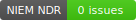
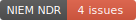

# NIEM JS - NDR Validation

This project tests the capability to evaluate NDR schematron rules on XML schemas in JavaScript.

## Goals

The goal of this effort is to create an automated and reusable way to implement NIEM conformance testing in a JavaScript environment.  Possibilities include:

- a NIEM JS library for IEPD support that can easily be installed and used by IEPD developers or by other tools
- templates for `package.json` scripts to test schemas, watch for file changes, etc.
- a `.travis.yml` configuration file, setting up NIEM conformance testing as part of an IEPD build and continuous integration process
- NIEM NDR conformance badges for IEPD readme files, such as:




## Status

This project uses Saxon-JS to transform NIEM XML schemas with pre-compiled NDR XSL rules to generate a list of conformance issues.  Saxon-JS is currently only implemented for in-browser support.  A Node.js version is projected to be released in 2019.  At that point, this code could be refactored, better separating the core functionality from the user interface.

The Saxon-JS library is crashing on transforms for large NIEM reference schemas.

## Usage

This app is hosted on GitHub pages at <https://cdmgtri.github.io/niem-ndr-validation-js>.

It can also be installed and served locally:

```js
npm i cdmgtri/niem-ndr-validation-js
npm start
```

## Functionality

- User selects one or more XSDs to upload
- User optionally selects a NDR rule set for evaluation
  - auto-detect (default option)
  - NDR 4.0 REF
  - NDR 4.0 EXT
- App displays file loading status during evaluation
- App displays conformance status per file
- App displays conformance issues, including
  - file
  - line number
  - component kind and name
  - link to the NDR rule
  - component snippet in table row expansion
- User may
  - sort and filter the conformance issues
  - download the conformance issues as a CSV file
  - download the conformance badge
  - rerun validation for modified files or for a different selected rule set

## Other notes

### Compiling SEFs

This project uses compiled version of the NDR stylesheets, as `.sef` (Stylesheet Export File) files.

In Oxygen, go to Tools > Compile XSL stylesheet for Saxon...

- Select `XSL URL`: Browse to the appropriate NDR `.sch.xsl` file from the full NDR zip.
- Select `Target` as "Saxon-JS"
- Make sure `Relocatable` is checked.
- Select output file, e.g., "NDR-4.0-EXT.sef"

### No support for NDR 3.0

The NDR 3.0 schematron files do not generate the same SVRL output as do the 4.0 files, so they are not supported at this time.
